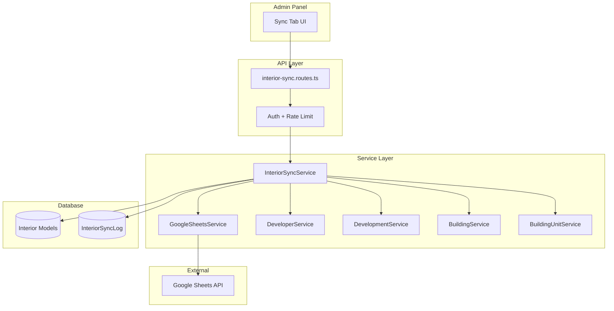

# Design Document: Interior Google Sheet Sync

## Overview

Tính năng đồng bộ 2 chiều giữa Google Sheet và Database cho module Interior Quote. Hệ thống cho phép Admin:
- **Pull**: Import dữ liệu từ Google Sheet vào DB (DuAn, LayoutIDs sheets)
- **Push**: Export dữ liệu từ DB ra Google Sheet
- **Preview**: Xem trước thay đổi trước khi sync
- **History**: Xem lịch sử các lần sync

## Architecture



## Components and Interfaces

### 1. API Routes (`api/src/routes/interior-sync.routes.ts`)

```typescript
// POST /api/admin/interior/sync/pull
interface PullRequest {
  sheetId: string;
  sheets: ('DuAn' | 'LayoutIDs')[];
}

interface PullResponse {
  success: boolean;
  results: {
    sheet: string;
    created: number;
    updated: number;
    skipped: number;
    errors: SyncError[];
  }[];
}

// POST /api/admin/interior/sync/push
interface PushRequest {
  sheetId: string;
  sheets: ('DuAn' | 'LayoutIDs')[];
}

interface PushResponse {
  success: boolean;
  results: {
    sheet: string;
    synced: number;
    errors: SyncError[];
  }[];
}

// GET /api/admin/interior/sync/preview
interface PreviewQuery {
  sheetId: string;
  sheet: 'DuAn' | 'LayoutIDs';
}

interface PreviewResponse {
  headers: string[];
  rows: PreviewRow[];
  summary: {
    add: number;
    update: number;
    unchanged: number;
  };
}

// GET /api/admin/interior/sync/status
interface StatusResponse {
  connected: boolean;
  sheetId: string | null;
  lastSync: string | null;
}

// GET /api/admin/interior/sync/logs
interface LogsQuery {
  page?: number;
  limit?: number;
}

interface LogsResponse {
  items: InteriorSyncLog[];
  total: number;
  page: number;
  limit: number;
}
```

### 2. Service Layer (`api/src/services/interior/sync.service.ts`)

```typescript
class InteriorSyncService {
  // Pull operations
  async pullFromSheet(sheetId: string, sheets: string[], userId: string): Promise<PullResult>
  async previewChanges(sheetId: string, sheet: string): Promise<PreviewResult>
  
  // Push operations
  async pushToSheet(sheetId: string, sheets: string[], userId: string): Promise<PushResult>
  
  // Status & History
  async getStatus(): Promise<SyncStatus>
  async getLogs(options: ListOptions): Promise<PaginatedResult<InteriorSyncLog>>
  
  // Internal parsing
  private parseDuAnSheet(rows: SheetRow[]): ParsedDuAnData[]
  private parseLayoutIDsSheet(rows: SheetRow[]): ParsedLayoutData[]
  
  // Internal sync
  private syncDuAnData(data: ParsedDuAnData[]): Promise<SyncResult>
  private syncLayoutData(data: ParsedLayoutData[]): Promise<SyncResult>
  
  // Type mapping
  private mapApartmentType(sheetValue: string): UnitType | null
}
```

### 3. Schema Definitions (`api/src/schemas/interior-sync.schema.ts`)

```typescript
// Zod schemas for validation
const PullRequestSchema = z.object({
  sheetId: z.string().min(1),
  sheets: z.array(z.enum(['DuAn', 'LayoutIDs'])).min(1),
});

const PushRequestSchema = z.object({
  sheetId: z.string().min(1),
  sheets: z.array(z.enum(['DuAn', 'LayoutIDs'])).min(1),
});

const PreviewQuerySchema = z.object({
  sheetId: z.string().min(1),
  sheet: z.enum(['DuAn', 'LayoutIDs']),
});

const LogsQuerySchema = z.object({
  page: z.coerce.number().int().positive().optional().default(1),
  limit: z.coerce.number().int().positive().max(100).optional().default(20),
});
```

## Data Models

### New Prisma Model: InteriorSyncLog

```prisma
model InteriorSyncLog {
  id          String   @id @default(cuid())
  direction   String   // 'pull' | 'push'
  sheetId     String
  sheetName   String
  status      String   // 'success' | 'partial' | 'failed'
  created     Int      @default(0)
  updated     Int      @default(0)
  skipped     Int      @default(0)
  errors      String?  // JSON array of errors
  syncedBy    String
  syncedAt    DateTime @default(now())
  
  @@index([syncedAt])
  @@index([direction])
  @@index([status])
}
```

### Sheet Column Mappings

**DuAn Sheet:**
| Sheet Column | DB Field | Required |
|--------------|----------|----------|
| ChuDauTu | InteriorDeveloper.name | ✅ |
| TenDuAn | InteriorDevelopment.name | ✅ |
| MaDuAn | InteriorDevelopment.code | ✅ |
| TenToaNha | InteriorBuilding.name | ✅ |
| MaToaNha | InteriorBuilding.code | ✅ |
| SoTangMax | InteriorBuilding.totalFloors | ✅ |
| SoTrucMax | InteriorBuilding.unitsPerFloor | ✅ |

**LayoutIDs Sheet:**
| Sheet Column | DB Field | Required |
|--------------|----------|----------|
| LayoutAxis | Generated: {MaToaNha}_{SoTruc} | ✅ |
| MaToaNha | InteriorBuilding.code (lookup) | ✅ |
| SoTruc | InteriorBuildingUnit.axis | ✅ |
| ApartmentType | InteriorBuildingUnit.unitType | ✅ |

### Apartment Type Mapping

```typescript
const APARTMENT_TYPE_MAP: Record<string, UnitType> = {
  '1pn': '1PN',
  '1pn+': '1PN',
  '2pn': '2PN',
  '3pn': '3PN',
  '4pn': '4PN',
  'studio': 'STUDIO',
  'penthouse': 'PENTHOUSE',
  'duplex': 'DUPLEX',
  'shophouse': 'SHOPHOUSE',
};
```

## Correctness Properties

*A property is a characteristic or behavior that should hold true across all valid executions of a system-essentially, a formal statement about what the system should do. Properties serve as the bridge between human-readable specifications and machine-verifiable correctness guarantees.*

### Property 1: Pull parsing produces valid structures
*For any* valid sheet data with all required columns, parsing SHALL produce a non-empty array of parsed records with all required fields populated.
**Validates: Requirements 1.1**

### Property 2: DuAn upsert correctness
*For any* valid DuAn row data, if a record with matching key (MaDuAn + MaToaNha) exists in DB, it SHALL be updated; otherwise a new record SHALL be created.
**Validates: Requirements 1.2**

### Property 3: LayoutIDs upsert correctness
*For any* valid LayoutIDs row data, if a BuildingUnit with matching (buildingId, axis) exists, it SHALL be updated; otherwise a new record SHALL be created.
**Validates: Requirements 1.3**

### Property 4: Invalid rows are skipped with errors
*For any* row with missing required fields, the row SHALL be skipped and an error entry SHALL be added to the errors array.
**Validates: Requirements 1.4**

### Property 5: Pull summary counts are accurate
*For any* pull operation, the sum of (created + updated + skipped) SHALL equal the total number of rows processed.
**Validates: Requirements 1.5**

### Property 6: Sync result round-trip
*For any* valid sync result object, serializing to JSON then parsing back SHALL produce an equivalent object.
**Validates: Requirements 1.6, 1.7**

### Property 7: Push output contains required columns
*For any* push operation on DuAn sheet, the output SHALL contain columns: ChuDauTu, TenDuAn, MaDuAn, TenToaNha, MaToaNha, SoTangMax, SoTrucMax.
**Validates: Requirements 2.2**

### Property 8: Push LayoutIDs output format
*For any* push operation on LayoutIDs sheet, the output SHALL contain columns: LayoutAxis, MaToaNha, SoTruc, ApartmentType.
**Validates: Requirements 2.3**

### Property 9: Preview change classification
*For any* sheet row compared to DB state, the row SHALL be classified as exactly one of: 'add' (not in DB), 'update' (in DB with differences), or 'unchanged' (in DB with same values).
**Validates: Requirements 3.1, 3.2**

### Property 10: Sync log creation
*For any* completed sync operation, a log record SHALL be created with all required fields: direction, sheetId, sheetName, status, counts, syncedBy, syncedAt.
**Validates: Requirements 4.1**

### Property 11: Logs sorted by timestamp
*For any* log query result, logs SHALL be sorted by syncedAt in descending order.
**Validates: Requirements 4.2**

### Property 12: Apartment type mapping
*For any* known apartment type string (1pn, 2pn, 3pn, 1pn+, studio, penthouse, duplex), mapping SHALL return the corresponding UnitType enum value.
**Validates: Requirements 6.1**

### Property 13: Unknown type handling
*For any* unknown apartment type string, the system SHALL either skip the row or use a default value, and log a warning.
**Validates: Requirements 6.2**

### Property 14: Transaction rollback on failure
*For any* sync operation that fails partway through, all database changes SHALL be rolled back and no partial data SHALL persist.
**Validates: Requirements 7.2**

### Property 15: Rate limiting enforcement
*For any* sequence of sync requests from the same user within 60 seconds, only the first request SHALL succeed; subsequent requests SHALL return rate limit error.
**Validates: Requirements 8.1**

## Error Handling

### Error Types

```typescript
interface SyncError {
  row: number;
  field?: string;
  message: string;
  data?: Record<string, unknown>;
}

type SyncErrorCode = 
  | 'MISSING_REQUIRED_FIELD'
  | 'INVALID_APARTMENT_TYPE'
  | 'BUILDING_NOT_FOUND'
  | 'DUPLICATE_KEY'
  | 'SHEET_READ_ERROR'
  | 'SHEET_WRITE_ERROR'
  | 'RATE_LIMIT_EXCEEDED'
  | 'NOT_CONNECTED';
```

### Error Handling Strategy

1. **Row-level errors**: Skip row, log error, continue processing
2. **Sheet-level errors**: Fail entire sheet sync, rollback transaction
3. **Connection errors**: Return error immediately, no partial processing
4. **Rate limit**: Return 429 with retry-after header

## Testing Strategy

### Unit Tests
- Test apartment type mapping function
- Test row parsing functions
- Test change classification logic
- Test error handling for invalid data

### Property-Based Tests (using fast-check)
- Property 1: Parsing valid data produces valid structures
- Property 2-3: Upsert logic correctness
- Property 4: Invalid row handling
- Property 5: Count accuracy
- Property 6: JSON round-trip
- Property 9: Change classification
- Property 12-13: Type mapping

### Integration Tests
- Full pull flow with mock Google Sheets
- Full push flow with mock Google Sheets
- Transaction rollback on failure
- Rate limiting behavior
